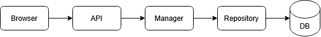

# Day 0 - 22/07
Started the project - my aim is to learn the latest in full stack development 1st, then later get hands-om with integrating an AI agent into the app. By the end of it, I want to polish my full stack development skills as well as learn AI fundamentals beyong using LLMs for coding. I will be working on this project emulating an engineering team, hence moving step by step, defining documents along the way.
Chalked out a basic vision document for the project, defining things like what this app does, who is it for, why am I building it, score of version 1, what does success look like for version 1.

# Day 1 - 23/07
Started working towards the system architecture.
Started by defining a list of Modules to be included in Version1
### Learning: 
A module is easily confused with a view, on basis that separation is visible in the UI. Instead, it might be better to think in terms of ownership. Is a journal affected if you remove say, a to-do reminder system from the app. Not really, so this might be a good separation point. 
Just because different parts of the app work in similar ways doesn't mean they are a single module. They might use the same utilities, but the ownership of responsibilities is still different. 
Ofcourse, in the end, its up to us to define the app architecture however we want.
## "Good architecture isn't about predicting the future. It's about making today's design easy to extend tomorrow."
Defined the following modules:
1. Job Manager
2. Task Manager
3. Journal Manager

## Design Decisions

Version 1 will be decomposed into business domains rather than UI pages.
Homepage will aggregate information rather than own it.
AI architecture is intentionally deferred until the non-AI architecture is stable.

# Day 2 - 24/07
Working on technical architecture today.
## Learning: 
It becomes important to separate the handling of the data from the point where data is entering. As such, the API should be a common point for entering the data processing logic. That way, the data entry becomes independent. If tomorrow, we swap out our website with a local app, the API remains unchanged. So does the dataa-handling.
Each layer has its own language, and need not know what language the next layer speaks.
### Repository: 
**A repository is the application's view of its data.** different repos for each Manager ensures that they maintain functional independence for future changes.
**The repositories are evolving independently because the domains are evolving independently.**

### Business Level: 
- Jobs
- Tasks
- Journal

### Technical Level:
- Job Manager - Job Repository
- Journal Manager - Journal Repository
- Task Manager - Task Repository

This kind of boundary that continues into layers is called **vertical slices**.

### Homepage
Should the homepage call 4 different APIs (GET /jobs, GET/tasks etc) and then assemble it or call 1 API (GET /dashboard) which assembles everything in the backend. It is a question of performance, which does not seem to be important at the current scope, but is an important point anyway.

# Day 3 - 25/07

Doubt: Need to figure out technical responsibilities of Job Manager
Good way to think about it what a `JobManager.create_job()` function doesn't need. It doesn't need HTTP, or SQL. We should be able to define its work by thinking about the business rules the Job Manager is responsible for.
For e.g.:
- A company name is mandatory.
- You cannot have two active applications to the same job posting.
- Every application automatically gets a follow-up reminder after 10 days unless the user specifies otherwise.
- If the company doesn't already exist, create it automatically.
If a job manager gets a job creation request from the API, it will check if the company already exists, if not then create one. is the date given, if not, calculate one. Once all this is done, then only send the create request to the API.

Note to self: There are technical aspects that I'm unsure about, for e.g. which SQL stack to use. Rather than filling something popular and common, I've left these decisions as undecided for now, to be attended to after I have more information.

## Day 3.1
Defining what `create_job()` does, needs us to first define what a job is. Or rather, what it means for us.
Defining a minimum definition for what needs to be included in a job. When I create a new job, what information would I want to the form to have? 
- Company
- Job Title
- Location
- Date Applied
- Status (Applied, rejected etc.)

### Validating the data according to product design philosophy
A JSON like `{company: 12345}` can be automatically rejected by the client using data type validation. But what if a request comes with `{company: ""}`. Do we want our DB to have job applications stored with no company names? It is obvious that this might as well be garbage data and the DB should require a company name. But thinking of it from a product perspective:
From a user's perspective, I believe seeing job applications with no company names will leave them confused. A user might waste time trying to track down this job application and find its Company by cross-referencing the date applied with their emails. or do a search for that particular job title in their emails. This is time that can be saved by enforcing that `{company: ""}` is invalid. **This is a business rule.**

Now, we can make similar decisions for all the data fields of a Job:
 - Company: Required
 - Job Title: Optional
 - Date Applied: Required - System Generated
 - Location: Optional
 - Status: Required - Defaults to "Applied", can be changed by User later

